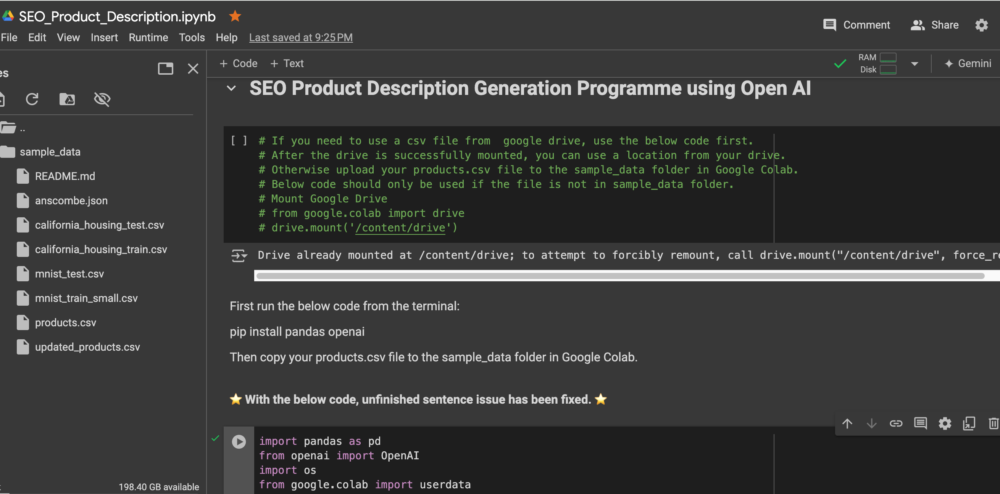
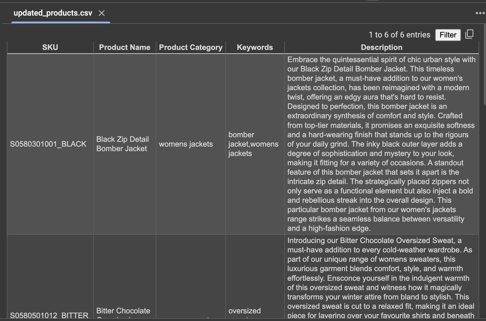

# codingTasks

# SEO Product Description Generator

## Project Description
This project reads product data from a CSV file and generates product descriptions using the OpenAI API. Learning to automate product description generation is important as it saves time and ensures consistency in content creation for e-commerce platforms.

## Table of Contents
- [Description](#description)
- [Installation](#installation)
- [Usage](#usage)
- [Generating OpenAI API Key](#generating-openai-api-key)
- [Screenshots](#screenshots)
- [Credits](#credits)

## Installation
To run this code, you need to install the required packages and set up your OpenAI API key.

1. Clone the repository:
    ```sh
    git clone https://github.com/aulgen/codingTasks.git
    
    ```
2. Install dependencies:
    ```sh
    pip install pandas openai google-colab
    ```
## Usage
1. Place your CSV file (e.g., `products.csv`) in the `sample_data` directory.
2. Open the Jupyter Notebook:
    ```sh
    jupyter notebook SEO_Product_Description.ipynb
    ```
3. Run all cells in the notebook to generate product descriptions. The script will generate product descriptions and save them in `updated_products.csv` in the `sample_data` directory.

## Generating OpenAI API Key
To use the OpenAI API, you need to generate an API key. Follow these steps to create an API key:

1. **Sign up / Log in**: Go to the [OpenAI website](https://beta.openai.com/signup/) and sign up for an account, or log in if you already have one.
2. **Navigate to API Keys**: Once logged in, click on your profile icon at the top right corner and select "API Keys" from the dropdown menu.
3. **Create New Key**: Click on the "Create new secret key" button. You will be prompted to name your API key.
4. **Copy the Key**: After creating the key, copy it immediately and store it in a secure location. You won't be able to see the full key again once you close this window.
5. **Set Up in Code**: Use this API key in your code to authenticate requests to the OpenAI API. In this project, you should replace the placeholder in the `api_key` variable with your actual API key.


## Screenshots
Sample Image for running the notebook:

Sample Image for generated Descriptions:


## Credits
- [Ayse Ulgen](https://github.com/aulgen)


